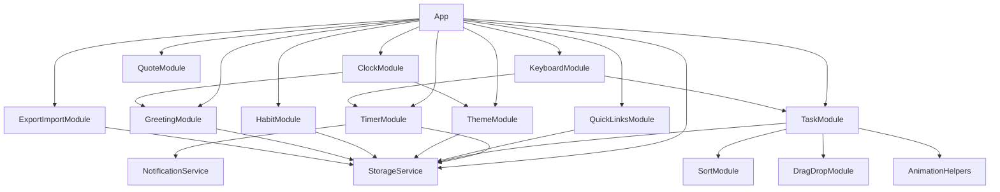
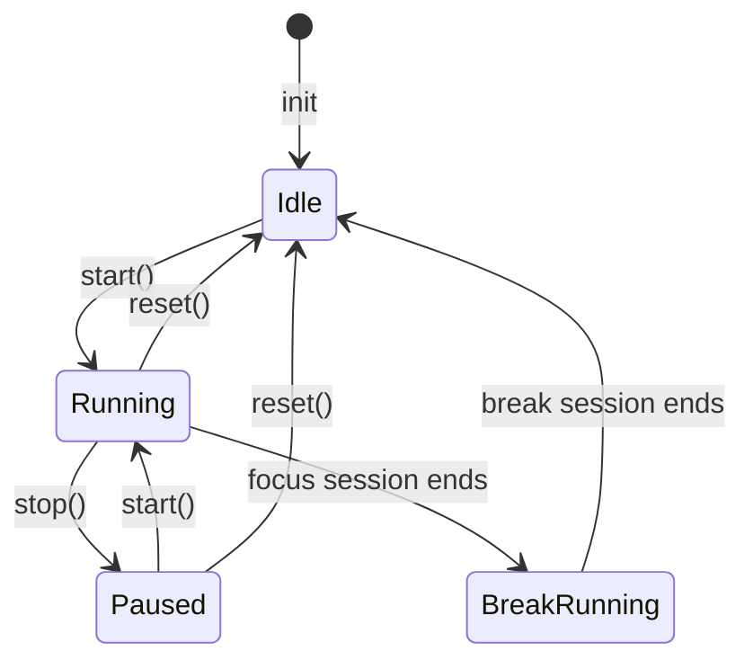

# Design Document: Todo Life Dashboard

## Overview

Todo Life Dashboard adalah single-page web application (SPA) yang berfungsi sebagai "homepage harian" personal. Seluruh aplikasi diimplementasikan dalam tiga file statis (`index.html`, `css/style.css`, `js/app.js`) menggunakan HTML5 + CSS3 + Vanilla JavaScript murni — tanpa framework, tanpa build tools, tanpa backend.

Arsitektur menggunakan **Revealing Module Pattern** berbasis objek literal JavaScript untuk memisahkan setiap fitur ke dalam modul yang independen namun dapat berkomunikasi melalui antarmuka publik yang terdefinisi. Semua data persisten disimpan di **Browser Local Storage**.

### Sasaran Desain

- **Maintainability**: Setiap fitur terisolasi dalam modulnya sendiri di dalam `app.js`
- **Correctness**: Fungsi-fungsi murni (pure functions) yang dapat diuji secara independen
- **Performance**: Minimal DOM mutation; animasi menggunakan CSS transitions/keyframes
- **Resilience**: Setiap operasi storage dibungkus dengan try/catch; UI tetap berfungsi meski storage gagal

---

## Architecture

### Modul Struktur (app.js)

Aplikasi menggunakan satu file `app.js` yang terorganisasi dalam blok fungsional dengan section header komentar. Setiap modul adalah objek literal yang dikembalikan oleh IIFE (Immediately Invoked Function Expression) atau factory function.

```
app.js
├── /* === STORAGE === */       StorageService
├── /* === CLOCK === */         ClockModule
├── /* === GREETING === */      GreetingModule
├── /* === TIMER === */         TimerModule
├── /* === TASKS === */         TaskModule
├── /* === SORTING === */       SortModule
├── /* === DRAG_DROP === */     DragDropModule
├── /* === QUICK_LINKS === */   QuickLinksModule
├── /* === THEME === */         ThemeModule
├── /* === QUOTES === */        QuoteModule
├── /* === HABITS === */        HabitModule
├── /* === EXPORT_IMPORT === */ ExportImportModule
├── /* === NOTIFICATIONS === */ NotificationService
├── /* === KEYBOARD === */      KeyboardModule
├── /* === ANIMATIONS === */    AnimationHelpers
└── /* === INIT === */          App.init()
```

### Dependency Graph



### Pola Komunikasi Antar-Modul

Modul-modul tidak mengimpor satu sama lain secara langsung. Semua modul dideklarasikan dalam scope global `App` dan berkomunikasi melalui referensi objek tersebut. Tidak ada event bus eksternal; modul yang membutuhkan notifikasi dari modul lain memanggil metode publiknya langsung.

---

## Components and Interfaces

### StorageService

Lapisan abstraksi tipis di atas `window.localStorage` yang menambahkan penanganan error.

```javascript
StorageService = {
  get(key)           // returns parsed value or null; never throws
  set(key, value)    // returns true on success, false on failure
  remove(key)        // removes key; returns true/false
  clear()            // clears all app keys; returns true/false
  KEYS               // object konstanta dengan semua storage key names
}
```

### ClockModule

Mengelola interval 1 detik yang mengupdate jam dan memicu update greeting/theme.

```javascript
ClockModule = {
  init()             // starts setInterval(1000), updates display
  getFormattedTime(date)  // pure: returns "HH:MM:SS"
  getFormattedDate(date)  // pure: returns "Selasa, 3 September 2026"
  getHour(date)      // pure: returns integer 0-23
  destroy()          // clears interval (for testing)
}
```

### GreetingModule

Menampilkan sapaan dan mengelola nama pengguna.

```javascript
GreetingModule = {
  init()                        // loads name from storage, renders
  getGreeting(hour)             // pure: hour (int) → greeting string
  formatGreetingWithName(greeting, name) // pure: string × string → string
  validateName(str)             // pure: string → boolean
  saveName(name)                // validates, stores, re-renders
  enterEditMode()               // shows input field with current name
  exitEditMode(save)            // saves or discards
}
```

### TimerModule

Focus timer dengan state machine: `idle → running → paused → idle`, dan mode `focus | break`.

```javascript
TimerModule = {
  init()                        // loads config from storage, renders
  start()                       // transitions to running state
  stop()                        // pauses without resetting
  reset()                       // resets to initial duration of current mode
  tick()                        // called by internal interval; decrements remaining
  formatTime(totalSeconds)      // pure: int → "MM:SS"
  isValidDuration(value)        // pure: any → boolean (1–180, numeric)
  setDuration(minutes)          // validates, stores, applies
  getState()                    // returns { mode, status, remaining, duration }
  _handleSessionEnd(mode)       // private: transitions between focus/break
}
```

**State Machine:**



### TaskModule

Mengelola CRUD task dan rendering daftar.

```javascript
TaskModule = {
  init()                        // loads tasks from storage, renders
  createTask(text, priority)    // pure factory: returns Task object
  addTask(text, priority)       // validates, deduplicates, stores, renders
  editTask(id, newText, newPriority) // updates task in storage, re-renders
  deleteTask(id)                // removes from storage, re-renders
  toggleComplete(id)            // flips done status, re-renders
  validateTaskText(str)         // pure: string → boolean
  isDuplicate(text, tasks)      // pure: string × Task[] → boolean
  getTaskById(id)               // pure: returns task or null
  getStats(tasks)               // pure: Task[] → { total, done, incomplete, percent }
  renderAll()                   // re-renders entire list
  renderStats()                 // updates progress ring/bar and counters
}
```

### SortModule

Kumpulan fungsi sorting murni (tidak mengubah array asli).

```javascript
SortModule = {
  sortByStatus(tasks)   // pure: Task[] → Task[] (incomplete first)
  sortByName(tasks)     // pure: Task[] → Task[] (A-Z case-insensitive)
  sortByNewest(tasks)   // pure: Task[] → Task[] (newest first)
  sortByOldest(tasks)   // pure: Task[] → Task[] (oldest first)
  apply(tasks, mode)    // pure: dispatches to correct sort fn
}
```

### DragDropModule

Mengelola HTML5 Drag and Drop API.

```javascript
DragDropModule = {
  init(containerEl)        // attaches DnD event listeners
  onDragStart(e)           // stores dragged task id
  onDragOver(e)            // shows drop indicator
  onDrop(e)                // computes new order, calls TaskModule.reorder()
  onDragEnd(e)             // cleans up indicator
  reorderArray(arr, from, to) // pure: returns new permutation
  isValidDrop(target)      // pure: boolean
}
```

### QuickLinksModule

Mengelola tautan favorit.

```javascript
QuickLinksModule = {
  init()                     // loads links from storage, renders
  addLink(label, url)        // validates, stores, renders
  deleteLink(id)             // removes from storage, renders
  validateURL(str)           // pure: string → boolean
  getFaviconURL(url)         // pure: string → favicon URL string
  renderAll()                // renders all links
}
```

### ThemeModule

Mengelola light/dark mode dan time-of-day theme.

```javascript
ThemeModule = {
  init()                      // loads preference, applies theme
  toggle()                    // flips light/dark
  getTimeTheme(hour)          // pure: int → 'dawn'|'day'|'dusk'|'night'
  applyTheme(mode, timeTheme) // applies CSS custom properties
  savePreference(mode)        // stores mode preference
  getStoredPreference()       // reads from storage
  update(hour)                // called by ClockModule every minute
}
```

### QuoteModule

Menampilkan kutipan harian dari koleksi lokal.

```javascript
QuoteModule = {
  init()                  // picks and renders random quote
  getRandomQuote(quotes)  // pure: Quote[] → Quote
  QUOTES                  // array of 10+ Quote objects
}
```

### HabitModule

Mini mood/habit check-in harian.

```javascript
HabitModule = {
  init()                       // loads today's mood from storage, renders
  selectMood(mood)             // toggles mood (deselects if same)
  isMoodForToday(storedDate)   // pure: string → boolean
  getTodayString()             // pure: returns YYYY-MM-DD
  renderMood(activeMood)       // updates emoji highlight state
}
```

### ExportImportModule

```javascript
ExportImportModule = {
  exportData()         // serializes all storage to JSON, triggers download
  importData(file)     // reads file, validates syntax + schema, replaces storage
  validateSchema(obj)  // pure: object → boolean
  SCHEMA_VERSION       // constant: current schema version string
}
```

### NotificationService

```javascript
NotificationService = {
  show(message, duration)   // displays toast notification, auto-hides
  playBeep()                // plays audio beep via Web Audio API
  requestPermission()       // requests browser notification permission
}
```

### KeyboardModule

```javascript
KeyboardModule = {
  init()               // attaches keydown listener to document
  handleKey(e)         // dispatches to correct module based on key + focus state
}
```

---

## Data Models

### Local Storage Keys (StorageService.KEYS)

```javascript
const KEYS = {
  USER_NAME:      'tld_user_name',      // string
  TASKS:          'tld_tasks',          // Task[] (JSON)
  TASK_ORDER:     'tld_task_order',     // string[] (ordered task IDs)
  SORT_MODE:      'tld_sort_mode',      // SortMode string
  TIMER_DURATION: 'tld_timer_duration', // number (minutes)
  QUICK_LINKS:    'tld_quick_links',    // QuickLink[] (JSON)
  THEME_MODE:     'tld_theme_mode',     // 'light' | 'dark'
  MOOD_ENTRY:     'tld_mood_entry',     // MoodEntry (JSON)
  SCHEMA_VERSION: 'tld_schema_version', // string e.g. "1.0"
}
```

### Task Object

```json
{
  "id":        "task_1696080000000_abc123",
  "text":      "Buat laporan mingguan",
  "done":      false,
  "priority":  "medium",
  "createdAt": "2026-09-03T08:00:00.000Z"
}
```

Tipe field:
- `id` — string, format `task_{timestamp}_{randomHex6}`
- `text` — string, 1–200 karakter
- `done` — boolean
- `priority` — enum: `"low"` | `"medium"` | `"high"`, default `"medium"`
- `createdAt` — string ISO 8601

### QuickLink Object

```json
{
  "id":    "link_1696080000000_def456",
  "label": "GitHub",
  "url":   "https://github.com"
}
```

### MoodEntry Object

```json
{
  "mood": "happy",
  "date": "2026-09-03"
}
```

Nilai `mood` yang valid: `"happy"` | `"neutral"` | `"sad"` | `"frustrated"`
Nilai `date` dalam format YYYY-MM-DD

### ExportImport Snapshot Object

Objek root yang dihasilkan oleh `exportData()`:

```json
{
  "schemaVersion": "1.0",
  "exportedAt":    "2026-09-03T08:00:00.000Z",
  "data": {
    "userName":      "Alvania",
    "tasks":         [],
    "taskOrder":     [],
    "sortMode":      "oldest",
    "timerDuration": 25,
    "quickLinks":    [],
    "themeMode":     "light",
    "moodEntry":     null
  }
}
```

### SortMode Enum

```
"status" | "az" | "newest" | "oldest"
```

---

## CSS Architecture

### File Structure (style.css)

```css
/* === RESET & BASE === */
/* === CSS CUSTOM PROPERTIES (TOKENS) === */
/* === TIME-OF-DAY THEMES === */
/* === LIGHT / DARK MODE OVERRIDES === */
/* === TYPOGRAPHY === */
/* === BENTO GRID LAYOUT === */
/* === GREETING WIDGET === */
/* === TIMER WIDGET === */
/* === TASK WIDGET === */
/* === QUICK LINKS WIDGET === */
/* === HABIT WIDGET === */
/* === QUOTE WIDGET === */
/* === THEME TOGGLE === */
/* === ANIMATIONS === */
/* === TOAST NOTIFICATIONS === */
/* === RESPONSIVE — TABLET === */
/* === RESPONSIVE — MOBILE === */
```

### Custom Property Naming Convention

Format: `--{scope}-{property}` di mana scope adalah kategori token.

**Base tokens (ditentukan di `:root`):**

```css
:root {
  /* Warna dasar */
  --color-bg-primary:    #f5f5f0;
  --color-bg-surface:    #ffffff;
  --color-bg-elevated:   #fafaf8;
  --color-text-primary:  #1a1a1a;
  --color-text-secondary:#555555;
  --color-text-muted:    #888888;
  --color-accent:        #4a7c59;
  --color-accent-light:  #e8f0eb;
  --color-border:        #e0e0e0;

  /* Priority colors */
  --color-priority-low:    #4caf50;
  --color-priority-medium: #ff9800;
  --color-priority-high:   #f44336;

  /* Timer */
  --color-timer-focus: #e74c3c;
  --color-timer-break: #27ae60;

  /* Gradient (dioverride oleh time-of-day theme) */
  --gradient-bg: linear-gradient(135deg, #667eea 0%, #764ba2 100%);

  /* Spacing */
  --space-xs: 4px;
  --space-sm: 8px;
  --space-md: 16px;
  --space-lg: 24px;
  --space-xl: 32px;

  /* Typography */
  --font-size-sm: 0.875rem;
  --font-size-md: 1rem;
  --font-size-lg: 1.25rem;
  --font-size-xl: 1.5rem;
  --font-size-2xl: 2rem;
  --font-size-clock: clamp(2.5rem, 5vw, 4rem);

  /* Radius */
  --radius-sm: 6px;
  --radius-md: 12px;
  --radius-lg: 20px;

  /* Transitions */
  --transition-theme: background-color 300ms ease, color 300ms ease, border-color 300ms ease;
  --transition-fast: 150ms ease;
  --transition-normal: 250ms ease;
}
```

### Time-of-Day Theme Layering

Time-of-day themes diaplikasikan melalui atribut `data-time-theme` pada `<body>`. Ini hanya mengoverride `--gradient-bg` dan `--color-accent`, sehingga tidak mengganggu preferensi light/dark.

```css
[data-time-theme="dawn"] {
  --gradient-bg: linear-gradient(135deg, #ff9a9e 0%, #fecfef 50%, #ffecd2 100%);
  --color-accent: #d4697a;
}

[data-time-theme="day"] {
  --gradient-bg: linear-gradient(135deg, #a8edea 0%, #fed6e3 100%);
  --color-accent: #4a7c59;
}

[data-time-theme="dusk"] {
  --gradient-bg: linear-gradient(135deg, #f093fb 0%, #f5576c 50%, #fda085 100%);
  --color-accent: #c0392b;
}

[data-time-theme="night"] {
  --gradient-bg: linear-gradient(135deg, #0c0c0c 0%, #1a1a2e 50%, #16213e 100%);
  --color-accent: #7f8ef0;
}
```

### Dark Mode Overrides

Dark mode diaplikasikan melalui atribut `data-theme="dark"` pada `<body>`. Ini mengoverride warna surface dan text, tapi membiarkan gradient dan accent dari time-of-day theme tetap aktif.

```css
[data-theme="dark"] {
  --color-bg-primary:    #121212;
  --color-bg-surface:    #1e1e1e;
  --color-bg-elevated:   #2a2a2a;
  --color-text-primary:  #f0f0f0;
  --color-text-secondary:#b0b0b0;
  --color-text-muted:    #707070;
  --color-border:        #333333;
}
```

Urutan aplikasi pada `<body>`:

```html
<body data-theme="light" data-time-theme="day">
```

CSS cascade: Base tokens → Time-of-day overrides → Dark mode overrides. Urutan deklarasi di stylesheet menentukan mana yang menang untuk property yang sama — dark mode dideklarasikan setelah time-of-day sehingga menang untuk warna surface/text, tetapi tidak mendefinisikan ulang `--gradient-bg` dan `--color-accent`.

---

## Bento-Grid Layout

### CSS Grid Template Areas

**Desktop (≥ 1024px):**

```
┌──────────────┬──────────────┬──────────────┐
│   greeting   │    timer     │ quick-links  │
│              │              │              │
├──────────────┴──────────────┼──────────────┤
│         tasks               │    habit     │
│                             │              │
│                             ├──────────────┤
│                             │    quote     │
└─────────────────────────────┴──────────────┘
```

```css
.dashboard-grid {
  display: grid;
  grid-template-columns: 1fr 1fr 1fr;
  grid-template-rows: auto 1fr;
  grid-template-areas:
    "greeting  timer      quick-links"
    "tasks     tasks      sidebar";
  gap: var(--space-md);
  height: 100vh;
  padding: var(--space-lg);
  box-sizing: border-box;
}

.widget-greeting    { grid-area: greeting; }
.widget-timer       { grid-area: timer; }
.widget-quick-links { grid-area: quick-links; }
.widget-tasks       { grid-area: tasks; }
.widget-sidebar     { grid-area: sidebar; display: flex; flex-direction: column; gap: var(--space-md); }
```

Sidebar berisi `.widget-habit` dan `.widget-quote` yang disusun secara vertikal di dalam `.widget-sidebar`.

**Tablet (768px – 1023px):**

```css
@media (min-width: 768px) and (max-width: 1023px) {
  .dashboard-grid {
    grid-template-columns: 1fr 1fr;
    grid-template-rows: auto;
    grid-template-areas:
      "greeting   timer"
      "tasks      quick-links"
      "tasks      habit"
      "tasks      quote";
    height: auto;
  }
}
```

**Mobile (< 768px):**

```css
@media (max-width: 767px) {
  .dashboard-grid {
    grid-template-columns: 1fr;
    grid-template-areas:
      "greeting"
      "timer"
      "tasks"
      "quick-links"
      "habit"
      "quote";
    height: auto;
  }
}
```

---

## Key Algorithms

### 1. Timer Countdown dengan Drift Correction

`setInterval` tidak akurat secara mutlak karena browser dapat men-throttle interval saat tab tidak aktif. Strategi drift correction menggunakan timestamp absolut.

```javascript
// Di dalam TimerModule
function start() {
  if (state.status === 'running') return;
  state.status = 'running';
  state.startTimestamp = Date.now();
  state.startRemaining = state.remaining;

  state.intervalId = setInterval(() => {
    const elapsed = Math.floor((Date.now() - state.startTimestamp) / 1000);
    const newRemaining = state.startRemaining - elapsed;

    if (newRemaining <= 0) {
      state.remaining = 0;
      clearInterval(state.intervalId);
      _handleSessionEnd(state.mode);
    } else {
      state.remaining = newRemaining;
    }
    renderTimer();
  }, 1000);
}
```

Ketika timer di-stop dan di-start lagi, `startTimestamp` dan `startRemaining` diperbarui dari kondisi saat ini, sehingga drift tidak akumulasi lintas pause/resume.

### 2. Duplicate Detection

```javascript
function normalize(str) {
  return str.trim().toLowerCase();
}

function isDuplicate(inputText, taskList) {
  const normalized = normalize(inputText);
  return taskList.some(task => normalize(task.text) === normalized);
}
```

Fungsi ini adalah fungsi murni yang dapat diuji secara independen.

### 3. Sort Algorithms (Pure Functions)

Semua fungsi sort tidak mengubah array asli (menggunakan `.slice()` sebelum `.sort()`).

```javascript
const SortModule = {
  sortByStatus(tasks) {
    return tasks.slice().sort((a, b) => {
      if (a.done === b.done) return 0;
      return a.done ? 1 : -1; // incomplete first
    });
  },

  sortByName(tasks) {
    return tasks.slice().sort((a, b) =>
      a.text.trim().toLowerCase().localeCompare(b.text.trim().toLowerCase())
    );
  },

  sortByNewest(tasks) {
    return tasks.slice().sort((a, b) => {
      if (!a.createdAt) return 1;
      if (!b.createdAt) return -1;
      return new Date(b.createdAt) - new Date(a.createdAt);
    });
  },

  sortByOldest(tasks) {
    return tasks.slice().sort((a, b) => {
      if (!a.createdAt) return 1;
      if (!b.createdAt) return -1;
      return new Date(a.createdAt) - new Date(b.createdAt);
    });
  },

  apply(tasks, mode) {
    const map = {
      status: this.sortByStatus,
      az:     this.sortByName,
      newest: this.sortByNewest,
      oldest: this.sortByOldest,
    };
    return (map[mode] || this.sortByOldest).call(this, tasks);
  }
};
```

### 4. Drag-and-Drop Reorder

Fungsi `reorderArray` adalah fungsi murni yang dapat diuji:

```javascript
function reorderArray(arr, fromIndex, toIndex) {
  if (fromIndex === toIndex) return arr.slice();
  const result = arr.slice();
  const [removed] = result.splice(fromIndex, 1);
  result.splice(toIndex, 0, removed);
  return result;
}
```

Properti yang harus dipertahankan: hasil adalah permutasi dari array asli (panjang sama, elemen sama).

### 5. Greeting Logic

```javascript
function getGreeting(hour) {
  if (hour >= 5  && hour <= 11) return 'Selamat pagi';
  if (hour >= 12 && hour <= 14) return 'Selamat siang';
  if (hour >= 15 && hour <= 17) return 'Selamat sore';
  return 'Selamat malam'; // 18-23 dan 0-4
}
```

### 6. Time-of-Day Theme Detection

```javascript
function getTimeTheme(hour) {
  if (hour >= 4  && hour <= 7)  return 'dawn';
  if (hour >= 8  && hour <= 16) return 'day';
  if (hour >= 17 && hour <= 19) return 'dusk';
  return 'night'; // 20-23 dan 0-3
}
```

### 7. Favicon Fetching

Menggunakan Google Favicon Service sebagai pendekatan client-side tanpa backend:

```javascript
function getFaviconURL(url) {
  try {
    const domain = new URL(url).hostname;
    return `https://www.google.com/s2/favicons?domain=${domain}&sz=32`;
  } catch {
    return null; // triggers generic icon fallback
  }
}
```

### 8. Progress Stats Calculation

```javascript
function getStats(tasks) {
  const total = tasks.length;
  if (total === 0) return { total: 0, done: 0, incomplete: 0, percent: 0 };
  const done = tasks.filter(t => t.done).length;
  return {
    total,
    done,
    incomplete: total - done,
    percent: Math.round((done / total) * 100)
  };
}
```

---

## Animation Specifications

Semua animasi menggunakan CSS `@keyframes` dan `animation` property (bukan JavaScript). JavaScript hanya menambah/menghapus CSS class untuk memicu animasi.

### 1. Widget Fade-In (saat halaman dimuat)

```css
@keyframes fadeInUp {
  from { opacity: 0; transform: translateY(16px); }
  to   { opacity: 1; transform: translateY(0); }
}

.widget {
  animation: fadeInUp 400ms ease forwards;
}

/* Staggered delay untuk setiap widget */
.widget-greeting    { animation-delay: 0ms; }
.widget-timer       { animation-delay: 80ms; }
.widget-quick-links { animation-delay: 160ms; }
.widget-tasks       { animation-delay: 240ms; }
.widget-sidebar     { animation-delay: 320ms; }
```

Durasi 400ms berada dalam rentang 200ms–600ms yang disyaratkan.

### 2. Checkbox Pop/Scale (saat task ditandai selesai)

```css
@keyframes checkboxPop {
  0%   { transform: scale(1); }
  50%  { transform: scale(1.4); }
  100% { transform: scale(1); }
}

.checkbox--animating {
  animation: checkboxPop 250ms ease;
}
```

Durasi 250ms berada dalam rentang 150ms–400ms yang disyaratkan.

### 3. Theme/Mode Transition

Ditangani langsung oleh CSS `transition` pada semua elemen yang menggunakan CSS custom properties:

```css
* {
  transition: var(--transition-theme);
}
```

`--transition-theme` = `background-color 300ms ease, color 300ms ease, border-color 300ms ease`. Berada dalam rentang 200ms–300ms.

### 4. Input Shake (saat duplikat ditolak)

```css
@keyframes shake {
  0%, 100% { transform: translateX(0); }
  20%       { transform: translateX(-8px); }
  40%       { transform: translateX(8px); }
  60%       { transform: translateX(-6px); }
  80%       { transform: translateX(6px); }
}

.input--shake {
  animation: shake 400ms ease;
}
```

Durasi 400ms berada dalam rentang 300ms–500ms yang disyaratkan. JavaScript menambahkan class ini, kemudian menghapusnya setelah `animationend` event.

### 5. Toast Notification

```css
@keyframes toastIn {
  from { opacity: 0; transform: translateY(20px); }
  to   { opacity: 1; transform: translateY(0); }
}

@keyframes toastOut {
  from { opacity: 1; transform: translateY(0); }
  to   { opacity: 0; transform: translateY(20px); }
}

.toast {
  animation: toastIn 200ms ease forwards;
}
.toast--hiding {
  animation: toastOut 200ms ease forwards;
}
```

---

## Correctness Properties

*A property is a characteristic or behavior that should hold true across all valid executions of a system — essentially, a formal statement about what the system should do. Properties serve as the bridge between human-readable specifications and machine-verifiable correctness guarantees.*

### Property 1: Greeting Function Coverage

*For any* integer hour in [0, 23], `getGreeting(hour)` returns exactly one of: "Selamat pagi", "Selamat siang", "Selamat sore", or "Selamat malam" — and never returns null, undefined, or an empty string.

**Validates: Requirements 1.3, 1.4, 1.5, 1.6**

---

### Property 2: Clock Time Formatting

*For any* integer `seconds` in [0, 5999], `TimerModule.formatTime(seconds)` returns a string matching the pattern `/^\d{2}:\d{2}$/`.

**Validates: Requirements 3.1**

---

### Property 3: Timer Duration Validation

*For any* value `x`, `TimerModule.isValidDuration(x)` returns `true` if and only if `x` is a numeric value in the range [1, 180] (inclusive). For any non-numeric value or value outside this range, it returns `false`.

**Validates: Requirements 4.2, 4.3, 4.4**

---

### Property 4: Whitespace Task Rejection

*For any* string composed entirely of whitespace characters (space, tab, newline), `TaskModule.validateTaskText(str)` returns `false`, and the task list remains unchanged after an add attempt with that string.

**Validates: Requirements 5.2, 17.4**

---

### Property 5: Task Whitespace Name Rejection

*For any* string composed entirely of whitespace characters, `GreetingModule.validateName(str)` returns `false`.

**Validates: Requirements 2.7**

---

### Property 6: Task Storage Round-Trip

*For any* valid `Task` object, serializing it to JSON and deserializing it back via `JSON.parse(JSON.stringify(task))` produces an object with identical `id`, `text`, `done`, `priority`, and `createdAt` fields.

**Validates: Requirements 5.3, 6.3**

---

### Property 7: Task Completion Toggle

*For any* task `t`, calling `toggleComplete` on it produces a task where `done === !t.done` and all other fields remain unchanged.

**Validates: Requirements 5.5**

---

### Property 8: Default Priority Assignment

*For any* call to `TaskModule.createTask(text)` where no priority is specified, the resulting task has `priority === "medium"`.

**Validates: Requirements 6.4**

---

### Property 9: Priority Class Uniqueness

*For any* two distinct priority values `p1` and `p2` in `{"low", "medium", "high"}` where `p1 !== p2`, `getPriorityClass(p1) !== getPriorityClass(p2)` — each priority maps to a unique, non-empty CSS class string.

**Validates: Requirements 6.2**

---

### Property 10: Duplicate Detection

*For any* string `s`, `TaskModule.isDuplicate(s, tasks)` returns `true` if and only if `tasks` contains at least one task where `normalize(task.text) === normalize(s)` (where `normalize` performs trim + toLowerCase).

**Validates: Requirements 7.1**

---

### Property 11: Sort Preserves All Tasks (Permutation Invariant)

*For any* array of tasks `tasks` and any sort mode `m`, `SortModule.apply(tasks, m)` returns an array with the same length and the same set of task IDs as the original `tasks` array (i.e., the result is a permutation).

**Validates: Requirements 8.2, 8.3, 8.4, 8.5, 8.7**

---

### Property 12: Sort Does Not Mutate Original

*For any* array of tasks `tasks` and any sort mode `m`, after calling `SortModule.apply(tasks, m)`, the original `tasks` array is unchanged (same order, same length, same elements).

**Validates: Requirements 8.7**

---

### Property 13: Sort-by-Status Invariant

*For any* list of tasks, in the result of `SortModule.sortByStatus(tasks)`, every task at a lower index with `done === false` appears before every task with `done === true`. That is: for all indices `i < j`, if `result[j].done === false` then `result[i].done === false`.

**Validates: Requirements 8.2**

---

### Property 14: Sort-by-Name Alphabetical Invariant

*For any* list of tasks, in the result of `SortModule.sortByName(tasks)`, for all adjacent pairs `(result[i], result[i+1])`, `normalize(result[i].text) <= normalize(result[i+1].text)` using locale-aware comparison.

**Validates: Requirements 8.3**

---

### Property 15: Drag-and-Drop Reorder is a Permutation

*For any* task array `arr` and any valid indices `fromIndex` and `toIndex` in `[0, arr.length - 1]`, `DragDropModule.reorderArray(arr, fromIndex, toIndex)` returns an array of the same length containing the same elements (a permutation of `arr`).

**Validates: Requirements 9.1, 9.2**

---

### Property 16: Progress Stats Correctness

*For any* non-empty array of tasks `tasks`, `TaskModule.getStats(tasks).percent === Math.round(tasks.filter(t => t.done).length / tasks.length * 100)` and `getStats(tasks).incomplete === tasks.filter(t => !t.done).length`.

**Validates: Requirements 10.1, 10.2**

---

### Property 17: URL Validation

*For any* string `s` that does not start with `"http://"` or `"https://"` (case-sensitive), `QuickLinksModule.validateURL(s)` returns `false`.

**Validates: Requirements 11.3**

---

### Property 18: Theme Toggle is Its Own Inverse

*For any* theme mode `m` in `{"light", "dark"}`, `toggle(toggle(m)) === m` — toggling twice returns to the original mode.

**Validates: Requirements 12.2**

---

### Property 19: Time-of-Day Theme Coverage

*For any* integer hour in [0, 23], `ThemeModule.getTimeTheme(hour)` returns exactly one of: `"dawn"`, `"day"`, `"dusk"`, or `"night"` — and never returns null, undefined, or an unrecognized string.

**Validates: Requirements 13.1**

---

### Property 20: Quote Always From Local Collection

*For any* call to `QuoteModule.getRandomQuote(quotes)` where `quotes.length >= 1`, the returned value is an element of the `quotes` array (referential membership check via `quotes.includes(result)`).

**Validates: Requirements 14.2**

---

### Property 21: Mood Deselection (Toggle Idempotence)

*For any* mood value `m` in the valid set `{"happy", "neutral", "sad", "frustrated"}`, if the current active mood is also `m`, then calling `HabitModule.selectMood(m)` clears the selection — the resulting stored mood is `null`.

**Validates: Requirements 15.3**

---

### Property 22: Mood Date Staleness

*For any* date string `d` in YYYY-MM-DD format where `d !== getTodayString()`, `HabitModule.isMoodForToday(d)` returns `false`.

**Validates: Requirements 15.5**

---

### Property 23: Export-Import Round-Trip

*For any* valid application storage state `S`, exporting it with `ExportImportModule.exportData()` to produce a JSON string, then importing that string with `importData()`, results in a storage state functionally equivalent to `S` (all task IDs, texts, priorities, link labels, theme preferences, and mood entry are preserved).

**Validates: Requirements 16.1, 16.4**

---

### Property 24: Invalid JSON Import Does Not Mutate Storage

*For any* syntactically invalid JSON string `s`, after calling `ExportImportModule.importData()` with `s`, the contents of Local Storage remain unchanged from their state before the call.

**Validates: Requirements 16.5**

---

### Property 25: Invalid Schema Import Does Not Mutate Storage

*For any* syntactically valid JSON string `s` that fails schema validation (missing required fields, wrong types, or wrong `schemaVersion`), after calling `ExportImportModule.importData()` with `s`, the contents of Local Storage remain unchanged.

**Validates: Requirements 16.6**

---

## Error Handling

### Prinsip Umum

Seluruh operasi yang berinteraksi dengan penyimpanan eksternal (Local Storage) atau API browser (Web Notifications, Web Audio API) dibungkus dengan `try/catch`. Kegagalan pada operasi ini tidak boleh menyebabkan crash aplikasi — widget harus tetap berfungsi dalam mode degraded.

### StorageService Error Handling

```javascript
set(key, value) {
  try {
    localStorage.setItem(key, JSON.stringify(value));
    return true;
  } catch (e) {
    // QuotaExceededError or SecurityError
    console.error(`[Storage] Failed to set "${key}":`, e);
    NotificationService.show('Gagal menyimpan data. Penyimpanan mungkin penuh.', 4000);
    return false;
  }
}
```

### Per-Modul Error Responses

| Modul | Skenario Error | Respons |
|---|---|---|
| TimerModule | Storage gagal saat menyimpan durasi | Toast error; durasi aktif tetap digunakan (Req 4.7) |
| TaskModule | Storage gagal saat add/edit/delete | Toast error; UI tidak diupdate (operasi dibatalkan) |
| TaskModule | DnD storage gagal | Toast error; urutan dikembalikan ke sebelum drag (Req 9.5) |
| QuickLinksModule | Storage gagal saat add | Toast error; link tidak ditampilkan (Req 11.9) |
| HabitModule | Storage gagal saat simpan mood | Toast error singkat; emoji tetap interaktif (Req 15.6) |
| ExportImportModule | Impor JSON sintaks invalid | Error message spesifik "Sintaks JSON tidak valid" (Req 16.5) |
| ExportImportModule | Impor JSON skema tidak cocok | Error message spesifik "Format data tidak sesuai" (Req 16.6) |
| NotificationService | Web Audio API tidak tersedia | Silent fail; notifikasi teks tetap ditampilkan |
| QuickLinksModule | Favicon gagal dimuat | `onerror` handler ganti ke ikon generik (Req 11.6) |

### Validasi Input

Semua input pengguna divalidasi sebelum masuk ke storage menggunakan fungsi-fungsi pure validator yang terdefinisi di masing-masing modul. Urutan validasi:

1. **Kehadiran** — field wajib tidak boleh kosong (setelah trim)
2. **Tipe** — nilai harus sesuai tipe yang diharapkan
3. **Batas** — panjang/nilai dalam rentang yang diizinkan
4. **Format** — string sesuai format yang ditentukan (URL, tanggal, dll.)
5. **Duplikasi** — untuk task, cek keunikan sebelum menyimpan

---

## Testing Strategy

### Pendekatan Dual Testing

Strategi pengujian menggunakan dua jenis test yang saling melengkapi:

- **Unit tests**: Memverifikasi contoh spesifik, edge case, dan kondisi error
- **Property-based tests**: Memverifikasi properti universal yang berlaku untuk semua input

### Unit Testing

Unit test difokuskan pada:
- Contoh spesifik yang menunjukkan perilaku yang benar
- Titik integrasi antar komponen
- Edge case dan kondisi error

Library yang direkomendasikan: [Vitest](https://vitest.dev/) atau Jest (dijalankan sebagai Node.js test untuk fungsi-fungsi pure).

Contoh test spesifik yang perlu dicakup:
- Setiap preset durasi timer (15, 25, 45, 60 menit) di-set dengan benar
- State machine timer: `idle → running → paused → running → idle`
- Transisi mode timer: focus session end → break dimulai otomatis
- Tampilan greeting saat nama belum tersimpan vs. sudah tersimpan
- Default sort "Terlama" saat pertama kali dimuat
- Mood emoji yang sama di-klik dua kali → deselect

### Property-Based Testing

Properti dari bagian Correctness Properties di atas diimplementasikan menggunakan library PBT. Library yang direkomendasikan: **[fast-check](https://fast-check.dev/)** (JavaScript, tidak memerlukan build tool untuk test runner berbasis Node).

**Konfigurasi minimum 100 iterasi per property test.**

Setiap property test diberi tag komentar dengan format:
```javascript
// Feature: todo-life-dashboard, Property N: <property_text>
```

Contoh implementasi:

```javascript
import fc from 'fast-check';
import { getGreeting } from '../js/app.js'; // atau module yang diekstrak

// Feature: todo-life-dashboard, Property 1: getGreeting returns valid greeting for any hour
test('greeting function covers all hours', () => {
  const validGreetings = ['Selamat pagi', 'Selamat siang', 'Selamat sore', 'Selamat malam'];
  fc.assert(
    fc.property(fc.integer({ min: 0, max: 23 }), (hour) => {
      const result = getGreeting(hour);
      return validGreetings.includes(result);
    }),
    { numRuns: 100 }
  );
});
```

### Scope Test

Karena seluruh aplikasi adalah file statis tanpa modul ES yang di-bundle, fungsi-fungsi pure (validator, formatter, sorter, calculator) dapat diekstrak ke dalam file terpisah untuk keperluan testing, atau diekspos melalui `window.App` global saat dijalankan di browser/jsdom.

Prioritas coverage:
1. **Fungsi pure kritis**: `getGreeting`, `formatTime`, `isValidDuration`, `validateTaskText`, `isDuplicate`, `sortBy*`, `reorderArray`, `getStats`, `validateURL`, `getTimeTheme`
2. **Storage round-trips**: task CRUD, timer config, theme preference, mood entry
3. **State machines**: timer state, sort mode, mood toggle
